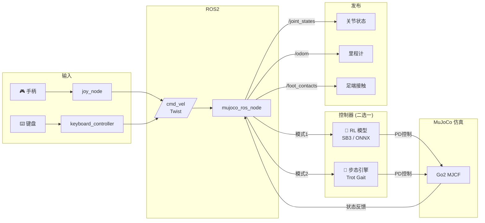

# Sim2Sim — Go2 四足机器人 MuJoCo 仿真控制器

> **MuJoCo 物理仿真 + 步态引擎 / RL 模型 + ROS2 手柄/键盘交互**

[](https://python.org)
[](https://mujoco.org)
[](https://docs.ros.org/en/humble/)
[](LICENSE)

---

## 📁 项目结构

```
sim2sim/
├── config/
│   └── robot/go2.yaml           # 机器人参数
│
├── src/
│   ├── mjcf/go2/go2.xml         # MuJoCo MJCF 机器人模型
│   └── ros2_bridge/
│       └── mujoco_ros_node.py   # 核心：步态引擎 / RL 推理 + 仿真 + ROS2 发布
│
├── ros2_ws/src/cs_joy/          # ROS2 控制包
│   ├── package.xml
│   ├── setup.py
│   └── cs_joy/
│       ├── joy_controller.py    #   手柄 → /cmd_vel (Twist)
│       └── keyboard_controller.py # 键盘 → /cmd_vel (Twist)
│
├── scripts/
│   └── ros2_bringup.sh          # 一键启动
├── requirements.txt
└── README.md
```

---

## 🏗️ 系统架构



---

## 🚀 快速开始

### 1. 环境准备

```bash
cd sim2sim

# 创建虚拟环境
python3 -m venv venv && source venv/bin/activate

# 安装基础依赖
pip install -r requirements.txt
```

### 2. 步态引擎模式 (默认，无需 RL)

```bash
python -m src.ros2_bridge.mujoco_ros_node --standalone
```

| 按键 | 功能 |
|------|------|
| `W/S` | 前进 / 后退 |
| `A/D` | 左移 / 右转 |
| `Q/E` | 左转 / 右转 |
| `Space` | 停止 |
| `Esc` | 退出 |

### 3. RL 模型模式

用训练好的策略网络替代步态引擎，48 维观测 → 12 维关节动作：

```bash
# SB3 模型 (.zip)
pip install stable-baselines3 torch
python -m src.ros2_bridge.mujoco_ros_node --standalone --model models/go2_ppo.zip

# ONNX 模型 (推荐，轻量)
pip install onnxruntime
python -m src.ros2_bridge.mujoco_ros_node --standalone --model models/go2_ppo.onnx
```

### 4. ROS2 手柄/键盘控制

```bash
# 构建 ROS2 工作空间
cd ros2_ws
colcon build --symlink-install
source install/setup.bash

# 键盘控制
bash scripts/ros2_bringup.sh --keyboard

# 手柄控制 (按住 LB 开始)
bash scripts/ros2_bringup.sh --joy
```

ROS2 模式同样支持 `--model` 加载 RL 模型。

---

## 🧠 RL 模型推理流程

```
手柄/键盘 → /cmd_vel ──→ 48维观测 ──→ RL 模型 ──→ 12维动作 ──→ PD → MuJoCo
                             ↑                        │
                        _build_obs()              target_pos
```

### 观测空间 (48维)

| 维度 | 含义 | 缩放 |
|------|------|------|
| [0:3] | 基座线速度 (世界系) | ×0.5 |
| [3:6] | 基座角速度 | ×0.25 |
| [6:9] | 重力方向投影 (机体系) | — |
| [9:12] | 速度指令 `[vx, vy, vyaw]` | — |
| [12:24] | 12 关节位置 (相对默认姿态) | — |
| [24:36] | 12 关节速度 | ×0.05 |
| [36:48] | 上一次动作 | — |

### 动作空间 (12维)

```
[FL_hip_x, FL_hip_y, FL_knee, FR_hip_x, FR_hip_y, FR_knee,
 RL_hip_x, RL_hip_y, RL_knee, RR_hip_x, RR_hip_y, RR_knee]
```

动作缩放 ×0.5 叠加到默认站立姿态 → PD 位置控制。

---

## 🦿 步态引擎

内置对角小跑步态 (trot gait)，当未加载 RL 模型时默认使用：

- FL + RR 为一组，FR + RL 为另一组，交替支撑/摆动
- 根据 `/cmd_vel` 自动调整步幅和转向
- 50Hz PD 位置控制

---

## ⚙️ 机器人配置 (`config/robot/go2.yaml`)

```yaml
robot:
  body: {mass: 5.0}
  legs:
    hip_length: 0.085
    thigh_length: 0.2
    calf_length: 0.2
  joints:
    hip_x:  {lower: -0.5, upper: 0.5}
    hip_y:  {lower: -1.0, upper: 1.0}
    knee:   {lower: -2.5, upper: -0.5}
  motors:
    kp: 60.0           # PD 位置增益
    kd: 2.0            # 速度阻尼
```

---

## 🔧 ROS2 话题

| 话题 | 类型 | 方向 | 说明 |
|------|------|------|------|
| `/cmd_vel` | `Twist` | 订阅 | 速度指令 `(vx, vy, vyaw)` |
| `/joint_states` | `JointState` | 发布 | 12 关节状态 |
| `/odom` | `Odometry` | 发布 | 基座位姿 + 速度 |
| `/foot_contacts` | `Float32MultiArray` | 发布 | 四足触地 `[0/1]×4` |

---

## 📝 依赖

| 用途 | 包 |
|------|-----|
| 物理仿真 | `mujoco>=3.1.0` |
| 渲染 | `mujoco-python-viewer` |
| 基础 | `numpy`, `pyyaml` |
| RL (SB3) | `stable-baselines3`, `torch` |
| RL (ONNX) | `onnxruntime` |
| 机器人中间件 | ROS2 Humble (可选) |

## 📜 License

Apache License 2.0
